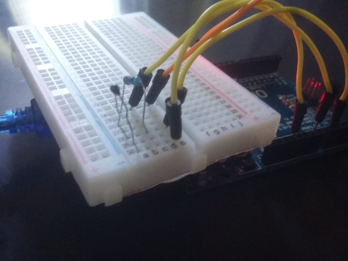

# Integração Arduino com MATLAB (Leitura de Termistor)

No projeto desenvolvido foi utilizado um termistor NTC 10K.

1) O microprocessador Atmega328P faz a conversão A/D do divisor de tensão do NTC com um resistor de 10K.
2) É feito um cálculo, corrigindo a forma não linear do sensor de temperatura
3) Esse valor de temperatura é enviada para a porta de comunicação
4) O MATLAB recebe a temperatura pela porta de comunicação
5) No MATLAB é possível definir o número de amostras e o intervalo entre elas, resultando em uma temperatura média desse período

Imagem do circuito:

